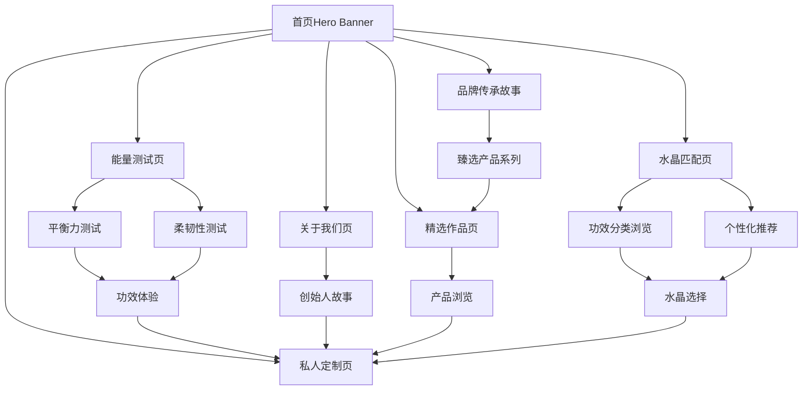

# 爻光晶舍官网产品需求文档

## 1. 产品概览

**品牌名称：** 爻光晶舍  
**品牌定位：** 高端奢侈品水晶珠宝品牌  
**域名地址：** dorblecapital.com

本项目是为爻光晶舍打造的奢侈品级别官网，专注于展示顶级水晶珠宝设计作品和品牌传承。网站采用奢侈品行业标准的极简主义设计风格，参考Tiffany、Cartier等顶级珠宝品牌，通过精致的视觉呈现和优雅的交互体验，突出水晶珠宝的艺术价值和奢华品质。

**核心价值：** 通过奢侈品级别的网站设计提升品牌形象，展示水晶珠宝的独特魅力和工艺传承，为高端客户提供沉浸式的奢华品牌体验，建立顶级珠宝品牌认知。

**目标市场：** 面向高净值人群，追求独特设计和顶级工艺的珠宝收藏家，以及寻求定制化奢侈品体验的精英客户。

## 2. 核心功能

### 2.1 用户角色

本官网主要面向普通访客，无需复杂的用户角色区分：

| 角色 | 访问方式 | 核心权限 |
|------|----------|----------|
| 普通访客 | 直接访问网站 | 浏览产品、查看公司信息、联系咨询 |

### 2.2 功能模块

YG水晶官网采用奢侈品行业标准的极简设计理念，包含以下核心页面：

1. **首页**：全屏Banner展示、品牌传承故事、臻选产品系列、品牌信息
2. **精选作品页**：高端水晶珠宝作品集、艺术化展示、产品网格展示
3. **关于我们页**：品牌历史、创始人介绍、设计理念、工艺传承
4. **能量测试页**：科学化展示水晶功效、实际测试方法、功效验证
5. **水晶匹配页**：水晶能量特质介绍、功效分类展示、个性化推荐、测试功能预留
6. **私人定制页**：定制服务介绍、咨询流程、联系方式

### 2.3 页面详情

| 页面名称 | 模块名称 | 功能描述 |
|----------|----------|----------|
| 首页 | Hero Banner | 全屏奢华大图展示、品牌Logo、简洁Slogan、优雅向下滚动引导 |
| 首页 | 品牌传承 | 左文右图布局、品牌历史故事、工艺传承介绍、留白≥30% |
| 首页 | 臻选系列 | 网格布局展示核心产品、间距≥40px、悬停轻微放大效果 |
| 首页 | 品牌信息 | 底部品牌联系信息、社交媒体、版权声明 |
| 首页 | 导航栏 | 透明背景、滚动时变实色、菜单间距≥30px、淡入下拉菜单 |
| 精选作品页 | 产品网格 | 高端网格布局、4K+高清产品图、圆角8-12px、悬停阴影加深 |
| 精选作品页 | 产品展示 | 水晶手串展示、产品名称、虚拟数据展示、响应式布局 |
| 关于我们页 | 品牌愿景 | 品牌理念展示、创始人介绍、设计哲学 |
| 关于我们页 | 创始人介绍 | 王成冲个人背景、从地产金融到水晶设计的转变历程 |
| 关于我们页 | 设计理念 | 设计哲学、工艺传承、品质追求 |
| 关于我们页 | 工艺流程 | 选材、设计、制作全流程展示 |
| 能量测试页 | 测试介绍 | 科学化展示水晶功效、消除虚无缥缈印象 |
| 能量测试页 | 平衡力测试 | 单脚平衡站立测试、压臂测试、佩戴前后对比、图示说明 |
| 能量测试页 | 柔韧性测试 | 站立体前屈测试、柔韧性改善展示、测量方法说明 |
| 能量测试页 | 其他功效 | 耐力、爆发力、专注力等长期功效介绍 |
| 能量测试页 | 测试指南 | 详细测试步骤、注意事项、科学性说明 |
| 水晶匹配页 | Hero区域 | 页面标题、水晶匹配理念介绍、优雅背景图 |
| 水晶匹配页 | 净化平衡系列 | 白水晶、月光石等净化类水晶介绍、功效说明、适用人群 |
| 水晶匹配页 | 智慧灵性系列 | 紫水晶、紫黄晶等智慧类水晶介绍、学习工作功效、创意提升 |
| 水晶匹配页 | 情感疗愈系列 | 粉水晶、蔷薇石英等情感类水晶介绍、人际关系改善、情感平衡 |
| 水晶匹配页 | 财富事业系列 | 黄水晶、绿幽灵等财运类水晶介绍、事业发展、财富积累 |
| 水晶匹配页 | 防护排负系列 | 黑曜石、黑碧玺等防护类水晶介绍、负能量清理、心理防护 |
| 水晶匹配页 | 健康活力系列 | 茶水晶、虎眼石等健康类水晶介绍、体质改善、活力提升 |
| 水晶匹配页 | 个性化推荐 | 根据需求分类的水晶推荐、搭配建议、使用指导 |
| 水晶匹配页 | 测试功能预留 | "测试功能待开放"按钮、未来功能预告、联系咨询入口 |
| 私人定制页 | 定制服务 | 定制流程介绍、服务标准、专属顾问联系 |
| 私人定制页 | 咨询表单 | 高端表单设计、客户信息收集、预约咨询功能 |

## 3. 核心流程

**高端客户浏览流程：**
高端客户进入网站后，首先体验奢华的全屏Banner视觉冲击，通过品牌传承故事了解YG水晶的历史底蕴和工艺价值。然后浏览臻选产品系列，进入精选作品页面深度欣赏水晶珠宝作品，通过关于我们页面了解创始人王成冲的故事和品牌理念，通过能量测试页面科学化体验水晶功效，通过水晶匹配页面了解不同水晶的能量特质和适用场景，最终通过私人定制页面进行专属咨询和定制服务。

## 4. 用户界面设计

### 4.1 奢侈品级设计风格

**整体风格：** 奢侈品极简主义、艺术化呈现、突出水晶珠宝的奢华质感

#### 4.1.1 色彩体系（奢侈品标准）
- **主色调：** 
  - 高级灰：#f8f9fa（米白）、#343a40（墨黑）、#6c757d（高级灰）
  - 避免高饱和色大面积使用，营造低调奢华氛围
- **辅助色：** 
  - 金属色：#d4af37（金）、#c0c0c0（银）、#e5e4e2（铂）用于强调质感
  - 渐变色模拟珠宝光泽：钻石折射光效、水晶透明质感
- **品牌专属色：** 
  - YG水晶蓝：#b8dce8（低饱和度蓝）作为品牌识别色
  - 仅用于Logo、重要按钮等关键元素点缀
- **背景规范：** 
  - 纯色背景为主，细微肌理（丝绒、皮革纹理）
  - 大幅留白，避免复杂图案干扰产品展示

#### 4.1.2 排版规范（奢侈品标准）
- **字体选择：** 
  - 标题：优雅衬线字体（Didot、Bodoni）体现奢华感
  - 正文：高可读性无衬线字体（Helvetica、Montserrat）
  - 中文：思源宋体（标题）、苹方（正文）
- **字体层级：** 
  - 标题字重偏轻（100-300）、字号大（桌面端≥36px）
  - 正文字重适中（400）、行高1.6-1.8
  - 段落间距≥1.5倍字号
- **装饰效果：** 
  - 首字母大写、单词间距加宽（0.1-0.2em）增强仪式感
  - 避免过度装饰，保持优雅简洁

#### 4.1.3 图像规范（4K+标准）
- **产品图：** 
  - 4K+超高清，突出材质细节（宝石切面、金属拉丝）
  - 背景纯净（白色/浅灰渐变）
  - 阴影自然柔和（模拟自然光照射）
- **场景图：** 
  - 艺术化构图，黑金暖调为主
  - 人物姿态优雅，场景留白充足
  - 避免杂乱元素干扰
- **图标设计：** 
  - 线性图标（线条粗细1-2px）
  - 圆角处理（2-4px）
  - 避免拟物化，可搭配金属色描边

#### 4.1.4 动效原则（优雅减速）
- **缓动曲线：** 
  - 使用ease-out或自定义贝塞尔曲线（cubic-bezier(0.16, 1, 0.3, 1)）
  - 体现"优雅减速"的奢华质感
- **触发方式：** 
  - 滚动触发渐显（产品图、文案）
  - 悬停时轻微放大（1.03-1.05倍）+ 阴影加深
  - 避免突兀的弹跳或闪烁
- **加载动效：** 
  - 品牌Logo轮廓的线性动画
  - 珠宝轮廓的描边动画替代传统Spinner

#### 4.1.5 交互规范（精致体验）
- **导航设计：** 
  - 固定顶部（透明→滚动时变实色）
  - 菜单项间距≥30px
  - 下拉菜单淡入（透明度0→1，耗时300ms）
  - 细微上浮效果
- **按钮设计：** 
  - 圆角8-12px
  - 背景色为品牌色或金属渐变
  - 悬停时轻微收缩（0.98倍）
  - 点击反馈用内阴影（而非颜色突变）
- **产品展示：** 
  - 支持360°旋转查看（鼠标拖动触发）
  - 放大查看用平滑过渡的弹出层
  - 避免新页面跳转

### 4.2 奢侈品级页面设计概览

| 页面名称 | 模块名称 | UI元素（奢侈品标准） |
|----------|----------|---------------------|
| 首页 | Hero Banner | 全屏奢华大图、品牌Logo（Didot字体）、简洁Slogan、优雅向下滚动指示器 |
| 首页 | 品牌传承 | 左文右图布局、思源宋体标题、留白≥30%、金属色点缀分割线 |
| 首页 | 臻选系列 | 网格布局、4K+产品图、圆角8px、间距≥40px、悬停阴影加深 |
| 首页 | 品牌信息 | 底部极简布局、金属色社交图标、版权信息（Helvetica字体） |
| 首页 | 导航栏 | 透明→滚动变实色、菜单间距≥30px、淡入下拉菜单（300ms） |
| 精选作品页 | 产品网格 | 高端网格布局、4K+产品图、悬停轻微放大（1.03倍）、阴影加深 |
| 精选作品页 | 产品展示 | 水晶手串图片、产品名称、极简卡片设计、响应式网格 |
| 关于我们页 | 品牌愿景 | 全屏Hero区域、品牌理念展示、优雅排版 |
| 关于我们页 | 创始人介绍 | 左文右图、王成冲个人照片、职业转变故事、金属色点缀 |
| 关于我们页 | 设计理念 | 艺术化构图、设计哲学展示、工艺传承介绍 |
| 能量测试页 | 测试介绍 | Hero区域、科学化标题、功效真实性强调、现代简约设计 |
| 能量测试页 | 平衡力测试 | 左图右文、测试步骤图示、对比效果展示、金属色强调元素 |
| 能量测试页 | 柔韧性测试 | 图文并茂、测试方法说明、前后对比视觉、测量标准展示 |
| 能量测试页 | 其他功效 | 网格布局、功效图标、简洁文字说明、长期效果强调 |
| 能量测试页 | 测试指南 | 步骤化展示、注意事项、科学性说明、行动召唤按钮 |
| 水晶匹配页 | Hero区域 | 全屏背景、优雅标题（思源宋体）、水晶匹配理念介绍、向下滚动指示器 |
| 水晶匹配页 | 功效分类 | 6个分类卡片、网格布局、圆角12px、悬停轻微放大、金属色点缀 |
| 水晶匹配页 | 水晶展示 | 每类3-4种水晶、高清水晶图片、名称+功效简介、优雅排版 |
| 水晶匹配页 | 个性化推荐 | 需求选择器、智能推荐算法、搭配建议、使用指导 |
| 水晶匹配页 | 测试功能预留 | 占位区域、"测试功能待开放"文字、联系咨询按钮、未来功能预告 |
| 私人定制页 | 定制服务 | 极简表单设计、输入框圆角8px、金属渐变提交按钮、专属顾问信息 |

### 4.3 组件库规范（奢侈品标准）

| 组件名称 | 用途 | 样式细则（Tailwind类） | 交互规则 |
|----------|------|----------------------|----------|
| 导航栏 | 主导航 | `bg-transparent/80 backdrop-blur-md py-6` | 滚动时 `bg-white shadow-sm` |
| 产品卡片 | 展示珠宝单品 | `rounded-xl overflow-hidden shadow-md hover:shadow-xl` | 悬停时 `transform: scale(1.02)` |
| 按钮（主） | 购买/预约 | `bg-gold-400 text-white px-8 py-3 rounded-full` | 点击时 `shadow-inner` |
| 按钮（次） | 次要操作 | `border border-gold-400 text-gold-400 px-8 py-3 rounded-full` | 悬停时 `bg-gold-400 text-white` |
| 产品图片 | 产品展示 | `aspect-square object-cover rounded-lg` | 悬停时 `scale-105 transition-transform` |
| 标题（大） | 页面主标题 | `font-serif text-6xl font-light tracking-wider` | 渐显动画 `fade-in-up` |
| 标题（中） | 区块标题 | `font-serif text-4xl font-light tracking-wide` | 滚动触发渐显 |
| 正文 | 内容文字 | `font-sans text-lg leading-relaxed` | 行高1.8，段落间距1.5倍 |

### 4.4 水晶匹配页详细功能规范

#### 4.4.1 水晶功效分类体系

**净化平衡系列** <mcreference link="https://health.baidu.com/m/detail/ar_5527540422524313346" index="1">1</mcreference>
- **白水晶**：被称为"水晶之王"，能量纯净，象征净化、专注与平衡。常用于清理负能量、增强记忆力和思维清晰度
- **月光石**：具有深层的情感治疗功能，能提高情商，安抚情绪的波动，使内心恢复平静 <mcreference link="http://www.zgsjbwg.com/dcjx/sjkp/2021-11-09/352.html" index="4">4</mcreference>
- **海蓝宝**：象征沉着与勇敢，能加强表达能力、说服力，可保旅行者平安 <mcreference link="http://www.nxly766.com/article/1890.htm" index="2">2</mcreference>

**智慧灵性系列** <mcreference link="https://health.baidu.com/m/detail/ar_5527540422524313346" index="1">1</mcreference>
- **紫水晶**：与顶轮能量关联，主智慧、灵性与直觉。学生或创意工作者常用它增强专注力与创造力
- **紫黄晶**：兼具黄晶与紫晶的功能，象征智慧与财富，又被称为"爱情调和石" <mcreference link="http://www.nxly766.com/article/1890.htm" index="2">2</mcreference>
- **托帕石**：古希腊人称为"有强大神奇力量的宝石"，可调节淋巴腺功能，增强表达能力 <mcreference link="http://www.zgsjbwg.com/dcjx/sjkp/2021-11-09/352.html" index="4">4</mcreference>

**情感疗愈系列** <mcreference link="https://health.baidu.com/m/detail/ar_5527540422524313346" index="1">1</mcreference>
- **粉水晶**：对应心轮，主情感疗愈与人际和谐。单身者佩戴可增强桃花运，已有伴侣者能促进感情升温
- **蔷薇石英**：能量更细腻，常用于修复情感创伤或增强同理心 <mcreference link="https://health.baidu.com/m/detail/ar_6106281836981454214" index="3">3</mcreference>
- **红纹石**：疗愈情感创伤，促进亲密关系中的坦诚与包容 <mcreference link="https://health.baidu.com/m/detail/ar_5527540422524313346" index="1">1</mcreference>

**财富事业系列** <mcreference link="https://health.baidu.com/m/detail/ar_5527540422524313346" index="1">1</mcreference>
- **黄水晶**：能量与太阳神经丛相连，象征财富、自信与行动力。商人或创业者常将其作为招财石
- **绿幽灵**：又名异象水晶，有助提高思维，具有招财和高度凝聚财富的力量，主正财 <mcreference link="http://www.nxly766.com/article/1890.htm" index="2">2</mcreference>
- **发晶**：能有效加强全身气场，建立勇气与信心，有招财之效能，使事业顺利 <mcreference link="http://www.nxly766.com/article/1890.htm" index="2">2</mcreference>

**防护排负系列** <mcreference link="https://health.baidu.com/m/detail/ar_6106281836981454214" index="3">3</mcreference>
- **黑曜石**：最常见的防护类水晶，通过吸附负能量起到"精神盾牌"作用，适合放置在玄关或随身携带
- **黑碧玺**：更侧重能量转化，可将负面情绪转化为行动力，适合高压职场人群 <mcreference link="https://health.baidu.com/m/detail/ar_6106281836981454214" index="3">3</mcreference>
- **虎眼石**：被印度人视为最尊贵的圣石，能激起信心、勇气与贯彻执行能力，也可以辟邪 <mcreference link="http://www.nxly766.com/article/1890.htm" index="2">2</mcreference>

**健康活力系列** <mcreference link="https://health.baidu.com/m/detail/ar_5527540422524313346" index="1">1</mcreference>
- **茶水晶**：稳定情绪，增强耐性，适合压力大或缺乏安全感者
- **石榴石**：对血液循环与荷尔蒙分泌都有一定的刺激作用，有益生殖系统健康 <mcreference link="http://www.nxly766.com/article/1890.htm" index="2">2</mcreference>
- **葡萄石**：能够促进血液循环，美容养颜，非常适合女性佩戴，可以增强免疫系统 <mcreference link="http://www.zgsjbwg.com/dcjx/sjkp/2021-11-09/352.html" index="4">4</mcreference>

#### 4.4.2 页面交互设计规范

**功效分类导航**
- 6个分类卡片采用2×3网格布局（桌面端）或1×6垂直布局（移动端）
- 每个卡片包含：分类图标、分类名称、简短描述（1-2句话）
- 悬停效果：轻微放大（1.03倍）+ 阴影加深 + 金属色边框高亮
- 点击后平滑滚动到对应分类内容区域

**水晶展示区域**
- 每个分类展示3-4种代表性水晶
- 左图右文布局：水晶高清图片 + 名称 + 功效介绍 + 适用人群
- 图片规格：正方形，圆角8px，悬停时轻微放大
- 文字层级：水晶名称（大标题）+ 功效简介（正文）+ 适用场景（小字）

**个性化推荐功能**
- 需求选择器：多选按钮形式，包含"学习工作"、"情感关系"、"财富事业"、"健康养生"、"心理防护"等选项
- 智能推荐：根据选择显示最匹配的3种水晶组合
- 搭配建议：提供佩戴方式、摆放位置、使用时机等指导

**测试功能预留区域**
- 占位卡片设计，与其他内容保持一致的视觉风格
- 中央显示"测试功能待开放"文字
- 下方提供"联系我们了解更多"按钮
- 预告文字："即将推出个性化水晶匹配测试，敬请期待"

### 4.5 响应式设计（奢侈品标准）

**设计原则：** 桌面端优先，移动端适配，在所有设备上保持奢华体验

- **桌面端 (1200px+)：** 
  - 全屏奢华展示，4K+大图片，丰富的视差效果
  - 鼠标悬停交互（轻微放大、阴影加深）
  - 360°产品查看功能，平滑弹出层
- **平板端 (768px-1200px)：** 
  - 保持全屏设计，适当调整字体大小（标题≥28px）
  - 简化动画效果，保持核心交互
  - 触摸友好的产品查看功能
- **移动端 (320px-768px)：** 
  - 垂直滚动优化，保持大图展示
  - 触摸友好的导航，手势滑动支持
  - 产品图片保持高清质量，适配屏幕尺寸
- **交互优化：** 
  - 平滑滚动、优雅的视差效果
  - 图片懒加载、WebP格式优化
  - 触摸滑动支持、手势识别

### 4.5 奢侈品级特殊设计要求

#### 4.5.1 品牌核心要素
- **品牌色值表：**
  - 主色：#f8f9fa (米白)、#343a40 (墨黑)、#6c757d (高级灰)
  - 金属色：#d4af37 (金)、#c0c0c0 (银)、#e5e4e2 (铂)
  - 品牌色：#b8dce8 (YG水晶蓝)
  - 应用场景：主色用于背景，金属色用于按钮强调，品牌色用于Logo点缀

- **字体清单：**
  - 标题字体：Didot (英文)、思源宋体 (中文)
  - 正文字体：Helvetica (英文)、苹方 (中文)
  - 字重范围：100-300 (标题)、400 (正文)
  - 字号范围：≥36px (桌面标题)、18px (正文)

- **Logo规范：**
  - 不同尺寸版本：16px、32px、64px、128px
  - 禁用规则：不可拉伸变形、不可改变颜色、最小使用尺寸16px
  - 安全区域：Logo周围至少保持1倍Logo高度的留白

#### 4.5.2 页面模板标准
- **首页模板：**
  - 顶部全屏Banner（图+短句Slogan）
  - 品牌传承故事（左文右图，留白≥30%）
  - 臻选产品系列（网格布局，间距≥40px）
  - 底部品牌信息（极简布局）

- **产品详情页模板：**
  - 左侧4K+大图（支持360°查看和放大）
  - 右侧产品名称/价格/描述（段落间距≥20px）
  - 定制选项（极简表单，输入框圆角8px）
  - 专属顾问联系（金属渐变按钮）

#### 4.5.3 性能与兼容性要求
- **图片标准：**
  - 必须使用WebP格式，4K+分辨率
  - 懒加载非首屏图片，产品图预加载缩略图
  - 自然柔和阴影，模拟自然光照射效果

- **加载速度：**
  - Lighthouse评分≥90
  - 首次内容绘制≤1.5s
  - 品牌Logo轮廓线性动画替代传统加载器

- **兼容性：**
  - 支持最新版Chrome/Safari（奢侈品用户多使用高端设备）
  - iOS ≥14，Android ≥10
  - 确保在高端设备上的完美体验

#### 4.5.4 内容规范
- **文案风格：**
  - 简洁优雅，避免口语化
  - 使用"臻选"而非"精选"，"典藏"而非"收藏"
  - 数字使用罗马数字（如"XXIII"替代"23"）增强仪式感

- **图片版权：**
  - 明确标注正版图库来源
  - 产品图需经品牌方审核确认细节无误
  - 场景图采用艺术化构图，黑金暖调为主