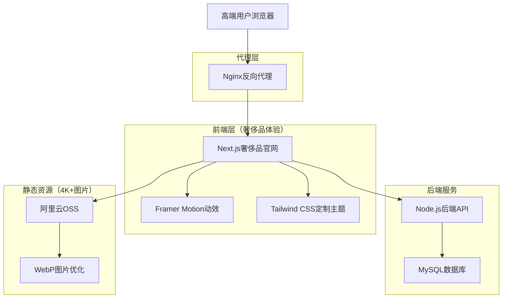
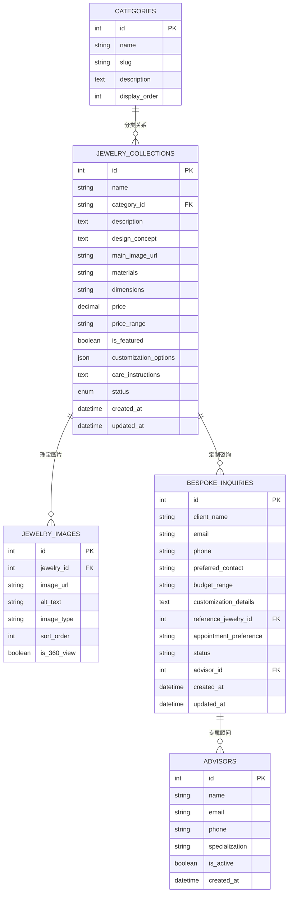

# 爻光晶舍官网技术架构文档

## 1. 架构设计



## 2. 技术描述（奢侈品标准）

**核心技术栈：**
- 前端：Next.js@15 + TypeScript@5 + Tailwind CSS@4 + Framer Motion + Zustand
- 后端：Node.js@22 + Express@4 + MySQL@8
- 部署：Nginx反向代理 + 宝塔面板管理
- 图片存储：阿里云OSS（4K+高清图片）
- 域名：dorblecapital.com (api.dorblecapital.com)

**奢侈品级技术选择理由：**
- **Next.js 15**：支持SSR/SSG提升首屏加载速度（奢侈品用户对延迟敏感），便于SEO优化
- **Framer Motion**：专业动效库，实现优雅减速的缓动曲线和奢华交互体验
- **Tailwind CSS 4 + 定制主题**：避免"工具类堆砌感"，通过@layer封装复用组件样式
- **TypeScript**：类型安全，确保代码质量符合奢侈品标准
- **Zustand**：轻量状态管理，适合管理购物车、用户收藏等简单状态
- **Next.js Image组件**：自动优化4K+高清图加载，避免性能问题
- **MySQL**：本地开发，后续部署到阿里云，支持高并发访问

**避免使用的技术：**
- 重型UI库（Material UI、Ant Design）：风格过于标准化，难以体现奢华定制感
- jQuery：不利于现代前端工程化，交互体验较粗糙
- 默认Tailwind工具类：通过定制主题和@layer封装，避免样式堆砌

## 3. 路由定义（奢侈品标准）

| 路由 | 用途 | 奢侈品体验特色 |
|------|------|---------------|
| / | 首页，奢华全屏Banner展示品牌传承和视觉冲击 | Hero Banner + 品牌传承故事 + 臻选系列 |
| /products | 精选作品页，高端网格展示水晶手串作品 | 4K+产品图 + 产品网格 + 悬停效果 |
| /about | 关于我们页，展示品牌历史和创始人故事 | 品牌愿景 + 创始人介绍 + 设计理念 |
| /energy-test | 能量测试页，科学化展示水晶功效和测试方法 | 平衡力测试 + 柔韧性测试 + 功效验证 |
| /crystal-matching | 水晶匹配页，展示水晶能量特质和功效分类 | 功效分类 + 水晶展示 + 个性化推荐 + 测试预留 |
| /bespoke | 私人定制页，定制服务和专属顾问联系 | 定制流程 + 咨询表单 + 专属服务 |

## 4. API定义（奢侈品标准）

### 4.1 核心API

珠宝系列列表相关
```
GET /api/collections
```

响应：
| 参数名称 | 参数类型 | 描述 |
|----------|----------|------|
| id | number | 珠宝ID |
| name | string | 珠宝名称 |
| description | string | 珠宝描述 |
| main_image_url | string | 主图URL（4K+） |
| category | string | 珠宝分类（戒指/项链/耳环等） |
| price_range | string | 价格区间 |
| is_featured | boolean | 是否为臻选系列 |
| created_at | string | 创建时间 |

珠宝详情相关
```
GET /api/collections/:id
```

响应：
| 参数名称 | 参数类型 | 描述 |
|----------|----------|------|
| id | number | 珠宝ID |
| name | string | 珠宝名称 |
| description | string | 详细描述 |
| images | array | 4K+图片数组（支持360°查看） |
| category | string | 珠宝分类 |
| materials | string | 使用材料（水晶/金属等） |
| dimensions | string | 尺寸规格 |
| price | number | 具体价格 |
| customization_options | array | 定制选项 |
| care_instructions | string | 保养说明 |
| created_at | string | 创建时间 |

私人定制咨询相关
```
POST /api/bespoke_inquiry
```

请求：
| 参数名称 | 参数类型 | 是否必需 | 描述 |
|----------|----------|----------|------|
| client_name | string | true | 客户姓名 |
| email | string | true | 客户邮箱 |
| phone | string | true | 客户电话（奢侈品必需） |
| preferred_contact | string | true | 偏好联系方式 |
| budget_range | string | false | 预算范围 |
| customization_details | string | true | 定制需求详情 |
| reference_jewelry_id | number | false | 参考珠宝ID |
| appointment_preference | string | false | 预约偏好时间 |

响应：
| 参数名称 | 参数类型 | 描述 |
|----------|----------|------|
| success | boolean | 提交状态 |
| message | string | 响应消息 |
| inquiry_id | number | 咨询单号 |
| advisor_contact | object | 专属顾问联系方式 |

## 5. 服务器架构图（奢侈品标准）

```mermaid
graph TD
    A[高端客户端请求] --> B[Nginx (端口80/443)]
    B --> C{域名路由}
    C -->|dorblecapital.com| D[Next.js官网 (端口3001)]
    C -->|api.dorblecapital.com| E[Node.js后端 (端口5000)]
    
    D --> F[静态文件服务]
    D --> G[API调用]
    G --> E
    
    subgraph "奢侈品服务器架构"
        B
        D
        E
        J[图片处理服务]
        K[定制咨询服务]
        L[缓存层Redis]
    end
    
    subgraph "数据层"
        H[MySQL数据库 (端口3306)]
        I[阿里云OSS]
    end
    
    E --> H
    D --> I
    E --> I
    E --> J
    E --> K
    E --> L
```

## 6. 数据模型（奢侈品标准）

### 6.1 数据模型定义

爻光晶舍官网的核心数据模型：



### 6.2 数据定义语言

**爻光晶舍官网奢侈品级数据库表结构：**

珠宝系列表 (jewelry_collections)
```sql
-- 创建表
CREATE TABLE jewelry_collections (
    id INT PRIMARY KEY AUTO_INCREMENT,
    name VARCHAR(255) NOT NULL COMMENT '珠宝名称',
    category VARCHAR(50) NOT NULL COMMENT '珠宝分类',
    description TEXT COMMENT '珠宝描述',
    materials VARCHAR(255) COMMENT '使用材料',
    dimensions VARCHAR(100) COMMENT '尺寸规格',
    price DECIMAL(10,2) COMMENT '具体价格',
    price_range VARCHAR(50) COMMENT '价格区间',
    is_featured BOOLEAN DEFAULT FALSE COMMENT '是否为臻选系列',
    customization_options JSON COMMENT '定制选项',
    care_instructions TEXT COMMENT '保养说明',
    created_at TIMESTAMP DEFAULT CURRENT_TIMESTAMP,
    updated_at TIMESTAMP DEFAULT CURRENT_TIMESTAMP ON UPDATE CURRENT_TIMESTAMP,
    INDEX idx_category (category),
    INDEX idx_is_featured (is_featured),
    INDEX idx_created_at (created_at DESC)
) ENGINE=InnoDB DEFAULT CHARSET=utf8mb4 COLLATE=utf8mb4_unicode_ci COMMENT='珠宝系列表';

-- 初始化奢侈品数据
INSERT INTO jewelry_collections (name, category, description, materials, dimensions, price, price_range, is_featured, customization_options, care_instructions) VALUES
('璀璨星辰戒指', '戒指', '灵感源自夜空中最亮的星，每一颗水晶都经过精心切割，展现出无与伦比的光芒', '18K白金，天然水晶，钻石', '戒圈直径16-20mm可调', 28800.00, '25000-35000', TRUE, '{"metal_options": ["18K白金", "18K黄金", "铂金"], "crystal_colors": ["无色", "香槟色", "粉色"], "engraving": true}', '避免接触化学物质，定期用软布擦拭，建议每年专业保养一次'),
('月光女神项链', '项链', '致敬古希腊月亮女神阿尔忒弥斯，链条如月光般柔美，水晶吊坠散发神秘光辉', '18K玫瑰金，月光石，水晶', '链长45cm，吊坠2.5cm×1.8cm', 45600.00, '40000-50000', TRUE, '{"chain_length": ["40cm", "45cm", "50cm"], "pendant_size": ["标准", "加大"], "gemstone_options": ["月光石", "蓝宝石", "祖母绿"]}', '避免撞击，存放时单独包装，避免与其他珠宝摩擦');
```

珠宝图片表 (jewelry_images)
```sql
-- 创建表
CREATE TABLE jewelry_images (
    id INT PRIMARY KEY AUTO_INCREMENT,
    jewelry_id INT NOT NULL COMMENT '珠宝ID',
    image_url VARCHAR(500) NOT NULL COMMENT '图片URL（4K+）',
    alt_text VARCHAR(255) COMMENT '图片描述',
    image_type ENUM('main', 'detail', '360_view', 'lifestyle') DEFAULT 'detail' COMMENT '图片类型',
    sort_order INT DEFAULT 0 COMMENT '排序',
    is_360_view BOOLEAN DEFAULT FALSE COMMENT '是否支持360°查看',
    created_at TIMESTAMP DEFAULT CURRENT_TIMESTAMP,
    FOREIGN KEY (jewelry_id) REFERENCES jewelry_collections(id) ON DELETE CASCADE,
    INDEX idx_jewelry_id (jewelry_id),
    INDEX idx_image_type (image_type),
    INDEX idx_sort_order (sort_order)
) ENGINE=InnoDB DEFAULT CHARSET=utf8mb4 COLLATE=utf8mb4_unicode_ci COMMENT='珠宝图片表（4K+）';

-- 初始化4K+图片数据
INSERT INTO jewelry_images (jewelry_id, image_url, alt_text, image_type, sort_order, is_360_view) VALUES
(1, 'https://oss.dorblecapital.com/jewelry/4k/ring-001-main.webp', '璀璨星辰戒指主图', 'main', 1, FALSE),
(1, 'https://oss.dorblecapital.com/jewelry/4k/ring-001-360.webp', '璀璨星辰戒指360°展示', '360_view', 2, TRUE),
(2, 'https://oss.dorblecapital.com/jewelry/4k/necklace-001-main.webp', '月光女神项链主图', 'main', 1, FALSE),
(2, 'https://oss.dorblecapital.com/jewelry/4k/necklace-001-lifestyle.webp', '月光女神项链佩戴效果', 'lifestyle', 2, FALSE);
```

分类表 (categories)
```sql
-- 创建表
CREATE TABLE categories (
    id INT PRIMARY KEY AUTO_INCREMENT,
    name VARCHAR(100) NOT NULL COMMENT '分类名称',
    slug VARCHAR(100) NOT NULL UNIQUE COMMENT '分类标识',
    description TEXT COMMENT '分类描述',
    display_order INT DEFAULT 0 COMMENT '显示顺序',
    created_at TIMESTAMP DEFAULT CURRENT_TIMESTAMP,
    INDEX idx_slug (slug),
    INDEX idx_display_order (display_order)
) ENGINE=InnoDB DEFAULT CHARSET=utf8mb4 COLLATE=utf8mb4_unicode_ci COMMENT='奢侈品分类表';

-- 初始化奢侈品分类数据
INSERT INTO categories (name, slug, description, display_order) VALUES
('戒指', 'rings', '精工细作的奢华水晶戒指，每一枚都是艺术品', 1),
('项链', 'necklaces', '优雅迷人的水晶项链，展现女性的高贵气质', 2),
('耳环', 'earrings', '精致典雅的水晶耳环，点亮您的每一个瞬间', 3),
('手镯', 'bracelets', '奢华精美的水晶手镯，腕间的艺术品', 4);
```

私人定制咨询表 (bespoke_inquiries)
```sql
-- 创建表
CREATE TABLE bespoke_inquiries (
    id INT PRIMARY KEY AUTO_INCREMENT,
    client_name VARCHAR(100) NOT NULL COMMENT '客户姓名',
    email VARCHAR(255) NOT NULL COMMENT '客户邮箱',
    phone VARCHAR(20) NOT NULL COMMENT '客户电话',
    preferred_contact ENUM('phone', 'email', 'wechat', 'in_person') DEFAULT 'phone' COMMENT '偏好联系方式',
    budget_range VARCHAR(50) COMMENT '预算范围',
    customization_details TEXT NOT NULL COMMENT '定制需求详情',
    reference_jewelry_id INT COMMENT '参考珠宝ID',
    appointment_preference VARCHAR(255) COMMENT '预约偏好时间',
    status ENUM('pending', 'contacted', 'in_progress', 'completed', 'cancelled') DEFAULT 'pending' COMMENT '处理状态',
    advisor_id INT COMMENT '专属顾问ID',
    created_at TIMESTAMP DEFAULT CURRENT_TIMESTAMP,
    updated_at TIMESTAMP DEFAULT CURRENT_TIMESTAMP ON UPDATE CURRENT_TIMESTAMP,
    FOREIGN KEY (reference_jewelry_id) REFERENCES jewelry_collections(id) ON DELETE SET NULL,
    FOREIGN KEY (advisor_id) REFERENCES advisors(id) ON DELETE SET NULL,
    INDEX idx_status (status),
    INDEX idx_created_at (created_at DESC),
    INDEX idx_advisor_id (advisor_id)
) ENGINE=InnoDB DEFAULT CHARSET=utf8mb4 COLLATE=utf8mb4_unicode_ci COMMENT='私人定制咨询表';
```

专属顾问表 (advisors)
```sql
-- 创建表
CREATE TABLE advisors (
    id INT PRIMARY KEY AUTO_INCREMENT,
    name VARCHAR(100) NOT NULL COMMENT '顾问姓名',
    email VARCHAR(255) NOT NULL COMMENT '顾问邮箱',
    phone VARCHAR(20) NOT NULL COMMENT '顾问电话',
    specialization VARCHAR(255) COMMENT '专业领域',
    is_active BOOLEAN DEFAULT TRUE COMMENT '是否在职',
    created_at TIMESTAMP DEFAULT CURRENT_TIMESTAMP,
    INDEX idx_is_active (is_active)
) ENGINE=InnoDB DEFAULT CHARSET=utf8mb4 COLLATE=utf8mb4_unicode_ci COMMENT='专属顾问表';

-- 初始化专属顾问数据
INSERT INTO advisors (name, email, phone, specialization, is_active) VALUES
('林雅婷', 'yating.lin@ygcrystal.com', '+86-138-0013-8888', '高端珠宝定制，水晶工艺专家', TRUE),
('陈志华', 'zhihua.chen@ygcrystal.com', '+86-139-0013-9999', '奢侈品销售，客户关系管理', TRUE);
```

## 7. 部署配置

### 7.1 Nginx配置

```nginx
# 官网配置
server {
    listen 80;
    server_name dorblecapital.com www.dorblecapital.com;
    
    location / {
        proxy_pass http://localhost:3001;
        proxy_set_header Host $host;
        proxy_set_header X-Real-IP $remote_addr;
        proxy_set_header X-Forwarded-For $proxy_add_x_forwarded_for;
        proxy_set_header X-Forwarded-Proto $scheme;
    }
}

# API配置
server {
    listen 80;
    server_name api.dorblecapital.com;
    
    location / {
        proxy_pass http://localhost:5000;
        proxy_set_header Host $host;
        proxy_set_header X-Real-IP $remote_addr;
        proxy_set_header X-Forwarded-For $proxy_add_x_forwarded_for;
        proxy_set_header X-Forwarded-Proto $scheme;
        
        # CORS配置
        add_header Access-Control-Allow-Origin *;
        add_header Access-Control-Allow-Methods "GET, POST, PUT, DELETE, OPTIONS";
        add_header Access-Control-Allow-Headers "Content-Type, Authorization";
    }
}
```

### 7.2 项目结构

```
yg-crystal-website/
├── src/
│   ├── app/                 # Next.js App Router
│   │   ├── page.tsx        # 首页（全屏滚动）
│   │   ├── works/          # 作品相关页面
│   │   │   ├── page.tsx    # 作品展示页
│   │   │   └── [id]/       # 作品详情页
│   │   ├── story/          # 品牌故事页
│   │   └── contact/        # 联系我们页
│   ├── components/         # 共用组件
│   │   ├── Header.tsx      # 网站头部（极简导航）
│   │   ├── Footer.tsx      # 网站底部
│   │   ├── FullScreenSection.tsx # 全屏滚动组件
│   │   ├── WorkCard.tsx    # 作品卡片
│   │   └── ContactForm.tsx # 定制咨询表单
│   ├── lib/               # 工具函数
│   │   ├── api.ts         # API调用封装
│   │   ├── scroll.ts      # 滚动动画工具
│   │   └── utils.ts       # 通用工具
│   └── types/             # TypeScript类型定义
│       ├── work.ts        # 作品相关类型
│       └── contact.ts     # 联系相关类型
├── public/                # 静态资源
│   └── images/            # 高质量作品图片
├── package.json
├── next.config.js
├── tailwind.config.js
├── framer-motion.config.js
└── tsconfig.json
```

### 7.3 环境配置

```bash
# .env.local
NEXT_PUBLIC_API_BASE_URL=https://api.dorblecapital.com
NEXT_PUBLIC_SITE_URL=https://dorblecapital.com
MYSQL_HOST=localhost
MYSQL_PORT=3306
MYSQL_DATABASE=yg_crystal
MYSQL_USER=root
MYSQL_PASSWORD=your_password
```

## 8. SEO优化方案

### 8.1 技术SEO
- **SSG静态生成**：作品页面使用静态生成，提高加载速度
- **元数据优化**：每个页面设置合适的title、description、keywords
- **结构化数据**：添加作品相关的JSON-LD结构化数据
- **网站地图**：自动生成sitemap.xml和robots.txt
- **语义化HTML**：使用合适的HTML标签结构

### 8.2 性能优化
- **图片优化**：使用Next.js Image组件，自动压缩和懒加载
- **代码分割**：按页面自动分割代码，减少首屏加载时间
- **CDN加速**：静态资源通过阿里云OSS CDN分发
- **缓存策略**：合理设置浏览器缓存和API缓存
- **全屏滚动优化**：使用Framer Motion优化滚动动画性能

### 8.3 移动端优化
- **响应式设计**：确保在各种设备上的视觉效果
- **触摸优化**：优化移动端的触摸交互体验
- **加载优化**：移动端优先加载关键内容