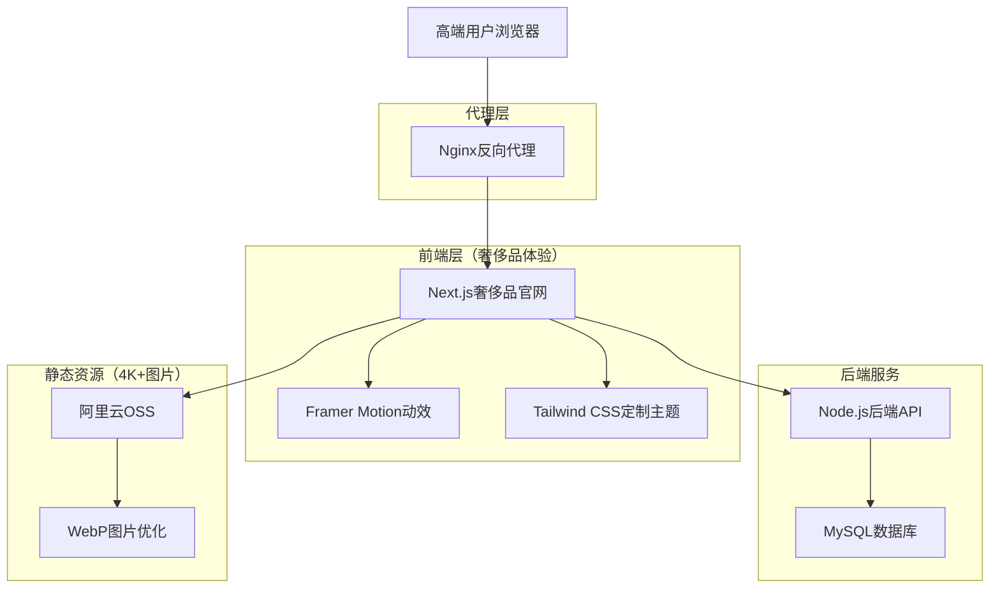
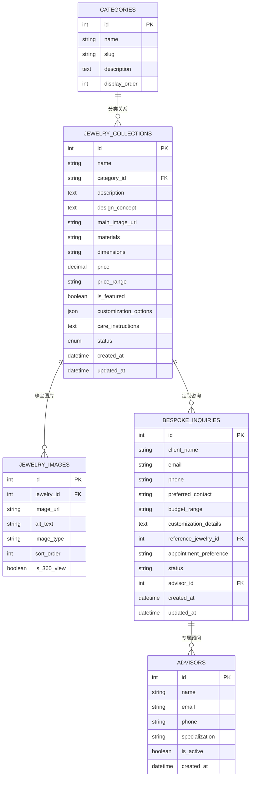
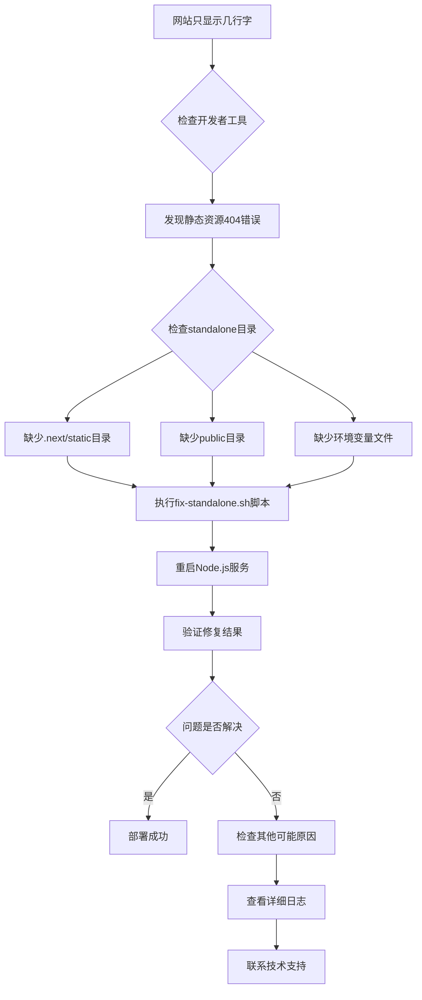

# 爻光晶舍官网技术架构文档

## 1. 架构设计



## 2. 技术描述（奢侈品标准）

**核心技术栈：**

* 前端：Next.js\@15 + TypeScript\@5 + Tailwind CSS\@4 + Framer Motion + Zustand

* 后端：Node.js\@22 + Express\@4 + MySQL\@8

* 部署：Nginx反向代理 + 宝塔面板管理

* 图片存储：阿里云OSS（4K+高清图片）

* 域名：dorblecapital.com (api.dorblecapital.com)

**奢侈品级技术选择理由：**

* **Next.js 15**：支持SSR/SSG提升首屏加载速度（奢侈品用户对延迟敏感），便于SEO优化

* **Framer Motion**：专业动效库，实现优雅减速的缓动曲线和奢华交互体验

* **Tailwind CSS 4 + 定制主题**：避免"工具类堆砌感"，通过@layer封装复用组件样式

* **TypeScript**：类型安全，确保代码质量符合奢侈品标准

* **Zustand**：轻量状态管理，适合管理购物车、用户收藏等简单状态

* **Next.js Image组件**：自动优化4K+高清图加载，避免性能问题

* **MySQL**：本地开发，后续部署到阿里云，支持高并发访问

**避免使用的技术：**

* 重型UI库（Material UI、Ant Design）：风格过于标准化，难以体现奢华定制感

* jQuery：不利于现代前端工程化，交互体验较粗糙

* 默认Tailwind工具类：通过定制主题和@layer封装，避免样式堆砌

## 3. 路由定义（奢侈品标准）

| 路由                | 用途                       | 奢侈品体验特色                     |
| ----------------- | ------------------------ | --------------------------- |
| /                 | 首页，奢华全屏Banner展示品牌传承和视觉冲击 | Hero Banner + 品牌传承故事 + 臻选系列 |
| /products         | 精选作品页，高端网格展示水晶手串作品       | 4K+产品图 + 产品网格 + 悬停效果        |
| /about            | 关于我们页，展示品牌历史和创始人故事       | 品牌愿景 + 创始人介绍 + 设计理念         |
| /energy-test      | 能量测试页，科学化展示水晶功效和测试方法     | 平衡力测试 + 柔韧性测试 + 功效验证        |
| /crystal-matching | 水晶匹配页，展示水晶能量特质和功效分类      | 功效分类 + 水晶展示 + 个性化推荐 + 测试预留  |
| /bespoke          | 私人定制页，定制服务和专属顾问联系        | 定制流程 + 咨询表单 + 专属服务          |

## 4. API定义（奢侈品标准）

### 4.1 核心API

珠宝系列列表相关

```
GET /api/collections
```

响应：

| 参数名称             | 参数类型    | 描述              |
| ---------------- | ------- | --------------- |
| id               | number  | 珠宝ID            |
| name             | string  | 珠宝名称            |
| description      | string  | 珠宝描述            |
| main\_image\_url | string  | 主图URL（4K+）      |
| category         | string  | 珠宝分类（戒指/项链/耳环等） |
| price\_range     | string  | 价格区间            |
| is\_featured     | boolean | 是否为臻选系列         |
| created\_at      | string  | 创建时间            |

珠宝详情相关

```
GET /api/collections/:id
```

响应：

| 参数名称                   | 参数类型   | 描述                |
| ---------------------- | ------ | ----------------- |
| id                     | number | 珠宝ID              |
| name                   | string | 珠宝名称              |
| description            | string | 详细描述              |
| images                 | array  | 4K+图片数组（支持360°查看） |
| category               | string | 珠宝分类              |
| materials              | string | 使用材料（水晶/金属等）      |
| dimensions             | string | 尺寸规格              |
| price                  | number | 具体价格              |
| customization\_options | array  | 定制选项              |
| care\_instructions     | string | 保养说明              |
| created\_at            | string | 创建时间              |

私人定制咨询相关

```
POST /api/bespoke_inquiry
```

请求：

| 参数名称                    | 参数类型   | 是否必需  | 描述          |
| ----------------------- | ------ | ----- | ----------- |
| client\_name            | string | true  | 客户姓名        |
| email                   | string | true  | 客户邮箱        |
| phone                   | string | true  | 客户电话（奢侈品必需） |
| preferred\_contact      | string | true  | 偏好联系方式      |
| budget\_range           | string | false | 预算范围        |
| customization\_details  | string | true  | 定制需求详情      |
| reference\_jewelry\_id  | number | false | 参考珠宝ID      |
| appointment\_preference | string | false | 预约偏好时间      |

响应：

| 参数名称             | 参数类型    | 描述       |
| ---------------- | ------- | -------- |
| success          | boolean | 提交状态     |
| message          | string  | 响应消息     |
| inquiry\_id      | number  | 咨询单号     |
| advisor\_contact | object  | 专属顾问联系方式 |

## 5. 服务器架构图（奢侈品标准）

```mermaid
graph TD
    A[高端客户端请求] --> B[Nginx (端口80/443)]
    B --> C{域名路由}
    C -->|dorblecapital.com| D[Next.js官网 (端口3001)]
    C -->|api.dorblecapital.com| E[Node.js后端 (端口5000)]
    
    D --> F[静态文件服务]
    D --> G[API调用]
    G --> E
    
    subgraph "奢侈品服务器架构"
        B
        D
        E
        J[图片处理服务]
        K[定制咨询服务]
        L[缓存层Redis]
    end
    
    subgraph "数据层"
        H[MySQL数据库 (端口3306)]
        I[阿里云OSS]
    end
    
    E --> H
    D --> I
    E --> I
    E --> J
    E --> K
    E --> L
```

## 6. 数据模型（奢侈品标准）

### 6.1 数据模型定义

爻光晶舍官网的核心数据模型：



### 6.2 数据定义语言

**爻光晶舍官网奢侈品级数据库表结构：**

珠宝系列表 (jewelry\_collections)

```sql
-- 创建表
CREATE TABLE jewelry_collections (
    id INT PRIMARY KEY AUTO_INCREMENT,
    name VARCHAR(255) NOT NULL COMMENT '珠宝名称',
    category VARCHAR(50) NOT NULL COMMENT '珠宝分类',
    description TEXT COMMENT '珠宝描述',
    materials VARCHAR(255) COMMENT '使用材料',
    dimensions VARCHAR(100) COMMENT '尺寸规格',
    price DECIMAL(10,2) COMMENT '具体价格',
    price_range VARCHAR(50) COMMENT '价格区间',
    is_featured BOOLEAN DEFAULT FALSE COMMENT '是否为臻选系列',
    customization_options JSON COMMENT '定制选项',
    care_instructions TEXT COMMENT '保养说明',
    created_at TIMESTAMP DEFAULT CURRENT_TIMESTAMP,
    updated_at TIMESTAMP DEFAULT CURRENT_TIMESTAMP ON UPDATE CURRENT_TIMESTAMP,
    INDEX idx_category (category),
    INDEX idx_is_featured (is_featured),
    INDEX idx_created_at (created_at DESC)
) ENGINE=InnoDB DEFAULT CHARSET=utf8mb4 COLLATE=utf8mb4_unicode_ci COMMENT='珠宝系列表';

-- 初始化奢侈品数据
INSERT INTO jewelry_collections (name, category, description, materials, dimensions, price, price_range, is_featured, customization_options, care_instructions) VALUES
('璀璨星辰戒指', '戒指', '灵感源自夜空中最亮的星，每一颗水晶都经过精心切割，展现出无与伦比的光芒', '18K白金，天然水晶，钻石', '戒圈直径16-20mm可调', 28800.00, '25000-35000', TRUE, '{"metal_options": ["18K白金", "18K黄金", "铂金"], "crystal_colors": ["无色", "香槟色", "粉色"], "engraving": true}', '避免接触化学物质，定期用软布擦拭，建议每年专业保养一次'),
('月光女神项链', '项链', '致敬古希腊月亮女神阿尔忒弥斯，链条如月光般柔美，水晶吊坠散发神秘光辉', '18K玫瑰金，月光石，水晶', '链长45cm，吊坠2.5cm×1.8cm', 45600.00, '40000-50000', TRUE, '{"chain_length": ["40cm", "45cm", "50cm"], "pendant_size": ["标准", "加大"], "gemstone_options": ["月光石", "蓝宝石", "祖母绿"]}', '避免撞击，存放时单独包装，避免与其他珠宝摩擦');
```

珠宝图片表 (jewelry\_images)

```sql
-- 创建表
CREATE TABLE jewelry_images (
    id INT PRIMARY KEY AUTO_INCREMENT,
    jewelry_id INT NOT NULL COMMENT '珠宝ID',
    image_url VARCHAR(500) NOT NULL COMMENT '图片URL（4K+）',
    alt_text VARCHAR(255) COMMENT '图片描述',
    image_type ENUM('main', 'detail', '360_view', 'lifestyle') DEFAULT 'detail' COMMENT '图片类型',
    sort_order INT DEFAULT 0 COMMENT '排序',
    is_360_view BOOLEAN DEFAULT FALSE COMMENT '是否支持360°查看',
    created_at TIMESTAMP DEFAULT CURRENT_TIMESTAMP,
    FOREIGN KEY (jewelry_id) REFERENCES jewelry_collections(id) ON DELETE CASCADE,
    INDEX idx_jewelry_id (jewelry_id),
    INDEX idx_image_type (image_type),
    INDEX idx_sort_order (sort_order)
) ENGINE=InnoDB DEFAULT CHARSET=utf8mb4 COLLATE=utf8mb4_unicode_ci COMMENT='珠宝图片表（4K+）';

-- 初始化4K+图片数据
INSERT INTO jewelry_images (jewelry_id, image_url, alt_text, image_type, sort_order, is_360_view) VALUES
(1, 'https://oss.dorblecapital.com/jewelry/4k/ring-001-main.webp', '璀璨星辰戒指主图', 'main', 1, FALSE),
(1, 'https://oss.dorblecapital.com/jewelry/4k/ring-001-360.webp', '璀璨星辰戒指360°展示', '360_view', 2, TRUE),
(2, 'https://oss.dorblecapital.com/jewelry/4k/necklace-001-main.webp', '月光女神项链主图', 'main', 1, FALSE),
(2, 'https://oss.dorblecapital.com/jewelry/4k/necklace-001-lifestyle.webp', '月光女神项链佩戴效果', 'lifestyle', 2, FALSE);
```

分类表 (categories)

```sql
-- 创建表
CREATE TABLE categories (
    id INT PRIMARY KEY AUTO_INCREMENT,
    name VARCHAR(100) NOT NULL COMMENT '分类名称',
    slug VARCHAR(100) NOT NULL UNIQUE COMMENT '分类标识',
    description TEXT COMMENT '分类描述',
    display_order INT DEFAULT 0 COMMENT '显示顺序',
    created_at TIMESTAMP DEFAULT CURRENT_TIMESTAMP,
    INDEX idx_slug (slug),
    INDEX idx_display_order (display_order)
) ENGINE=InnoDB DEFAULT CHARSET=utf8mb4 COLLATE=utf8mb4_unicode_ci COMMENT='奢侈品分类表';

-- 初始化奢侈品分类数据
INSERT INTO categories (name, slug, description, display_order) VALUES
('戒指', 'rings', '精工细作的奢华水晶戒指，每一枚都是艺术品', 1),
('项链', 'necklaces', '优雅迷人的水晶项链，展现女性的高贵气质', 2),
('耳环', 'earrings', '精致典雅的水晶耳环，点亮您的每一个瞬间', 3),
('手镯', 'bracelets', '奢华精美的水晶手镯，腕间的艺术品', 4);
```

私人定制咨询表 (bespoke\_inquiries)

```sql
-- 创建表
CREATE TABLE bespoke_inquiries (
    id INT PRIMARY KEY AUTO_INCREMENT,
    client_name VARCHAR(100) NOT NULL COMMENT '客户姓名',
    email VARCHAR(255) NOT NULL COMMENT '客户邮箱',
    phone VARCHAR(20) NOT NULL COMMENT '客户电话',
    preferred_contact ENUM('phone', 'email', 'wechat', 'in_person') DEFAULT 'phone' COMMENT '偏好联系方式',
    budget_range VARCHAR(50) COMMENT '预算范围',
    customization_details TEXT NOT NULL COMMENT '定制需求详情',
    reference_jewelry_id INT COMMENT '参考珠宝ID',
    appointment_preference VARCHAR(255) COMMENT '预约偏好时间',
    status ENUM('pending', 'contacted', 'in_progress', 'completed', 'cancelled') DEFAULT 'pending' COMMENT '处理状态',
    advisor_id INT COMMENT '专属顾问ID',
    created_at TIMESTAMP DEFAULT CURRENT_TIMESTAMP,
    updated_at TIMESTAMP DEFAULT CURRENT_TIMESTAMP ON UPDATE CURRENT_TIMESTAMP,
    FOREIGN KEY (reference_jewelry_id) REFERENCES jewelry_collections(id) ON DELETE SET NULL,
    FOREIGN KEY (advisor_id) REFERENCES advisors(id) ON DELETE SET NULL,
    INDEX idx_status (status),
    INDEX idx_created_at (created_at DESC),
    INDEX idx_advisor_id (advisor_id)
) ENGINE=InnoDB DEFAULT CHARSET=utf8mb4 COLLATE=utf8mb4_unicode_ci COMMENT='私人定制咨询表';
```

专属顾问表 (advisors)

```sql
-- 创建表
CREATE TABLE advisors (
    id INT PRIMARY KEY AUTO_INCREMENT,
    name VARCHAR(100) NOT NULL COMMENT '顾问姓名',
    email VARCHAR(255) NOT NULL COMMENT '顾问邮箱',
    phone VARCHAR(20) NOT NULL COMMENT '顾问电话',
    specialization VARCHAR(255) COMMENT '专业领域',
    is_active BOOLEAN DEFAULT TRUE COMMENT '是否在职',
    created_at TIMESTAMP DEFAULT CURRENT_TIMESTAMP,
    INDEX idx_is_active (is_active)
) ENGINE=InnoDB DEFAULT CHARSET=utf8mb4 COLLATE=utf8mb4_unicode_ci COMMENT='专属顾问表';

-- 初始化专属顾问数据
INSERT INTO advisors (name, email, phone, specialization, is_active) VALUES
('林雅婷', 'yating.lin@ygcrystal.com', '+86-138-0013-8888', '高端珠宝定制，水晶工艺专家', TRUE),
('陈志华', 'zhihua.chen@ygcrystal.com', '+86-139-0013-9999', '奢侈品销售，客户关系管理', TRUE);
```

## 7. 部署配置

### 7.1 Nginx配置

```nginx
# 官网配置
server {
    listen 80;
    server_name dorblecapital.com www.dorblecapital.com;
    
    location / {
        proxy_pass http://localhost:3001;
        proxy_set_header Host $host;
        proxy_set_header X-Real-IP $remote_addr;
        proxy_set_header X-Forwarded-For $proxy_add_x_forwarded_for;
        proxy_set_header X-Forwarded-Proto $scheme;
    }
}

# API配置
server {
    listen 80;
    server_name api.dorblecapital.com;
    
    location / {
        proxy_pass http://localhost:5000;
        proxy_set_header Host $host;
        proxy_set_header X-Real-IP $remote_addr;
        proxy_set_header X-Forwarded-For $proxy_add_x_forwarded_for;
        proxy_set_header X-Forwarded-Proto $scheme;
        
        # CORS配置
        add_header Access-Control-Allow-Origin *;
        add_header Access-Control-Allow-Methods "GET, POST, PUT, DELETE, OPTIONS";
        add_header Access-Control-Allow-Headers "Content-Type, Authorization";
    }
}
```

### 7.2 项目结构

```
yg-crystal-website/
├── src/
│   ├── app/                 # Next.js App Router
│   │   ├── page.tsx        # 首页（全屏滚动）
│   │   ├── works/          # 作品相关页面
│   │   │   ├── page.tsx    # 作品展示页
│   │   │   └── [id]/       # 作品详情页
│   │   ├── story/          # 品牌故事页
│   │   └── contact/        # 联系我们页
│   ├── components/         # 共用组件
│   │   ├── Header.tsx      # 网站头部（极简导航）
│   │   ├── Footer.tsx      # 网站底部
│   │   ├── FullScreenSection.tsx # 全屏滚动组件
│   │   ├── WorkCard.tsx    # 作品卡片
│   │   └── ContactForm.tsx # 定制咨询表单
│   ├── lib/               # 工具函数
│   │   ├── api.ts         # API调用封装
│   │   ├── scroll.ts      # 滚动动画工具
│   │   └── utils.ts       # 通用工具
│   └── types/             # TypeScript类型定义
│       ├── work.ts        # 作品相关类型
│       └── contact.ts     # 联系相关类型
├── public/                # 静态资源
│   └── images/            # 高质量作品图片
├── package.json
├── next.config.js
├── tailwind.config.js
├── framer-motion.config.js
└── tsconfig.json
```

### 7.3 环境配置

```bash
# .env.local
NEXT_PUBLIC_API_BASE_URL=https://api.dorblecapital.com
NEXT_PUBLIC_SITE_URL=https://dorblecapital.com
MYSQL_HOST=localhost
MYSQL_PORT=3306
MYSQL_DATABASE=yg_crystal
MYSQL_USER=root
MYSQL_PASSWORD=your_password
```

## 8. SEO优化方案

### 8.1 技术SEO

* **SSG静态生成**：作品页面使用静态生成，提高加载速度

* **元数据优化**：每个页面设置合适的title、description、keywords

* **结构化数据**：添加作品相关的JSON-LD结构化数据

* **网站地图**：自动生成sitemap.xml和robots.txt

* **语义化HTML**：使用合适的HTML标签结构

### 8.2 性能优化

* **图片优化**：使用Next.js Image组件，自动压缩和懒加载

* **代码分割**：按页面自动分割代码，减少首屏加载时间

* **CDN加速**：静态资源通过阿里云OSS CDN分发

* **缓存策略**：合理设置浏览器缓存和API缓存

* **全屏滚动优化**：使用Framer Motion优化滚动动画性能

### 7.4 域名SSL配置详解

#### 7.4.1 域名解析配置

**阿里云域名解析设置：**

```
域名：yg-crystal.com
记录类型：A
主机记录：@
记录值：139.224.189.1
TTL：600秒
```

**子域名配置（可选）：**

```
记录类型：CNAME
主机记录：www
记录值：yg-crystal.com
TTL：600秒
```

#### 7.4.2 SSL证书配置

**宝塔面板SSL证书申请步骤：**

1. **进入宝塔面板** → 网站 → 选择yg-crystal.com站点 → SSL

2. **选择Let's Encrypt证书**：
   - 域名：yg-crystal.com
   - 邮箱：填写有效邮箱地址
   - 勾选"强制HTTPS"
   - 点击"申请"

3. **证书自动续期**：
   - 宝塔面板会自动设置续期任务
   - 证书有效期90天，自动在到期前30天续期

#### 7.4.3 Nginx反向代理配置

**完整的Nginx站点配置：**

```nginx
server {
    listen 80;
    server_name yg-crystal.com www.yg-crystal.com;
    return 301 https://$server_name$request_uri;
}

server {
    listen 443 ssl http2;
    server_name yg-crystal.com www.yg-crystal.com;
    
    # SSL证书配置
    ssl_certificate /www/server/panel/vhost/cert/yg-crystal.com/fullchain.pem;
    ssl_certificate_key /www/server/panel/vhost/cert/yg-crystal.com/privkey.pem;
    ssl_protocols TLSv1.2 TLSv1.3;
    ssl_ciphers ECDHE-RSA-AES128-GCM-SHA256:HIGH:!aNULL:!MD5:!RC4:!DHE;
    ssl_prefer_server_ciphers on;
    ssl_session_cache shared:SSL:10m;
    ssl_session_timeout 10m;
    
    # 安全头配置
    add_header Strict-Transport-Security "max-age=31536000; includeSubDomains" always;
    add_header X-Frame-Options DENY;
    add_header X-Content-Type-Options nosniff;
    add_header X-XSS-Protection "1; mode=block";
    
    # 反向代理到Node.js应用
    location / {
        proxy_pass http://127.0.0.1:3002;
        proxy_set_header Host $host;
        proxy_set_header X-Real-IP $remote_addr;
        proxy_set_header X-Forwarded-For $proxy_add_x_forwarded_for;
        proxy_set_header X-Forwarded-Proto $scheme;
        proxy_set_header X-Forwarded-Host $host;
        proxy_set_header X-Forwarded-Port $server_port;
        
        # 超时设置
        proxy_connect_timeout 60s;
        proxy_send_timeout 60s;
        proxy_read_timeout 60s;
        
        # 缓存设置
        proxy_buffering on;
        proxy_buffer_size 4k;
        proxy_buffers 8 4k;
    }
    
    # 静态资源缓存
    location ~* \.(js|css|png|jpg|jpeg|gif|ico|svg|woff|woff2|ttf|eot)$ {
        proxy_pass http://127.0.0.1:3002;
        proxy_set_header Host $host;
        expires 1y;
        add_header Cache-Control "public, immutable";
    }
    
    # 访问日志
    access_log /www/wwwlogs/yg-crystal.com.log;
    error_log /www/wwwlogs/yg-crystal.com.error.log;
}
```

#### 7.4.4 Node.js服务配置

**Next.js Standalone模式配置：**

1. **next.config.js配置**：
```javascript
/** @type {import('next').NextConfig} */
const nextConfig = {
  output: 'standalone',
  experimental: {
    outputFileTracingRoot: path.join(__dirname, '../../'),
  },
  images: {
    unoptimized: true,
  },
  trailingSlash: false,
  generateEtags: false,
}

module.exports = nextConfig
```

2. **构建和部署脚本**：
```bash
# 构建应用
npm run build

# 复制静态资源到standalone目录（关键步骤）
cp -r .next/static .next/standalone/.next/
cp -r public .next/standalone/

# 复制环境变量文件
cp .env.production .next/standalone/
```

#### 7.4.5 PM2进程管理配置

**PM2配置文件 (ecosystem.config.js)：**

```javascript
module.exports = {
  apps: [{
    name: 'yg-crystal-website',
    script: '.next/standalone/server.js',
    cwd: '/www/wwwroot/yg-crystal-website',
    instances: 1,
    exec_mode: 'cluster',
    env: {
      NODE_ENV: 'production',
      PORT: 3002,
      HOSTNAME: '0.0.0.0'
    },
    error_file: '/www/wwwlogs/pm2/yg-crystal-website-error.log',
    out_file: '/www/wwwlogs/pm2/yg-crystal-website-out.log',
    log_file: '/www/wwwlogs/pm2/yg-crystal-website.log',
    time: true,
    max_memory_restart: '1G',
    node_args: '--max-old-space-size=1024'
  }]
}
```

**PM2常用命令：**

```bash
# 启动应用
pm2 start ecosystem.config.js

# 重启应用
pm2 restart yg-crystal-website

# 查看状态
pm2 status

# 查看日志
pm2 logs yg-crystal-website

# 监控
pm2 monit
```

#### 7.4.6 环境变量配置

**.env.production文件：**

```bash
# 应用配置
NODE_ENV=production
PORT=3002
HOSTNAME=0.0.0.0

# 网站配置
NEXT_PUBLIC_SITE_URL=https://yg-crystal.com
NEXT_PUBLIC_API_BASE_URL=https://yg-crystal.com/api

# 数据库配置
MYSQL_HOST=localhost
MYSQL_PORT=3306
MYSQL_DATABASE=yg_crystal
MYSQL_USER=yg_crystal_user
MYSQL_PASSWORD=your_secure_password

# 阿里云OSS配置
ALIBABA_CLOUD_ACCESS_KEY_ID=your_access_key
ALIBABA_CLOUD_ACCESS_KEY_SECRET=your_secret_key
ALIBABA_CLOUD_OSS_BUCKET=yg-crystal-assets
ALIBABA_CLOUD_OSS_REGION=oss-cn-hangzhou

# 豆包AI配置
DOUBAO_API_KEY=0a7c42e7-d1d3-4d53-9b83-dca43b9b2c81
DOUBAO_BASE_URL=https://ark.cn-beijing.volces.com/api/v3
DOUBAO_MODEL=doubao-1.5-pro-32k-250115
```

#### 7.4.7 静态资源配置详解

**Next.js Standalone模式静态资源处理：**

Next.js在standalone模式下不会自动复制静态资源，需要手动处理：

```bash
# 1. 复制.next/static目录到standalone目录
cp -r .next/static .next/standalone/.next/static

# 2. 复制public目录到standalone目录
cp -r public .next/standalone/public

# 3. 验证文件结构
ls -la .next/standalone/
# 应该包含：
# - .next/
# - public/
# - node_modules/
# - package.json
# - server.js
# - .env.production
```

**静态资源访问路径：**

- CSS文件：`/_next/static/css/[hash].css`
- JS文件：`/_next/static/chunks/[hash].js`
- 图片文件：`/images/[filename]`
- 字体文件：`/_next/static/media/[hash].[ext]`

#### 7.4.8 常见问题排查

**1. ERR_ABORTED错误解决方案：**

```bash
# 问题：静态资源返回404错误
# 原因：Next.js standalone模式未正确复制静态资源

# 解决步骤：
# 1. 检查静态资源是否存在
ls -la .next/standalone/.next/static/
ls -la .next/standalone/public/

# 2. 如果不存在，重新复制
cp -r .next/static .next/standalone/.next/
cp -r public .next/standalone/

# 3. 重启PM2服务
pm2 restart yg-crystal-website

# 4. 验证静态资源访问
curl -I https://yg-crystal.com/_next/static/css/[actual-hash].css
```

**2. SSL证书问题：**

```bash
# 检查证书状态
openssl x509 -in /www/server/panel/vhost/cert/yg-crystal.com/fullchain.pem -text -noout

# 测试SSL连接
openssl s_client -connect yg-crystal.com:443 -servername yg-crystal.com

# 强制续期证书（如果需要）
certbot renew --force-renewal -d yg-crystal.com
```

**3. 端口占用问题：**

```bash
# 检查端口占用
netstat -tlnp | grep :3002
lsof -i :3002

# 如果端口被占用，杀死进程
kill -9 [PID]

# 重启服务
pm2 restart yg-crystal-website
```

**4. 数据库连接问题：**

```bash
# 测试MySQL连接
mysql -h localhost -P 3306 -u yg_crystal_user -p yg_crystal

# 检查MySQL服务状态
systemctl status mysql

# 重启MySQL服务
systemctl restart mysql
```

**5. 日志查看和调试：**

```bash
# PM2应用日志
pm2 logs yg-crystal-website --lines 100

# Nginx访问日志
tail -f /www/wwwlogs/yg-crystal.com.log

# Nginx错误日志
tail -f /www/wwwlogs/yg-crystal.com.error.log

# 系统日志
journalctl -u nginx -f
```

#### 7.4.9 部署检查清单

**部署前检查：**

- [ ] 域名解析已正确配置（A记录指向139.224.189.1）
- [ ] SSL证书已申请并配置
- [ ] Nginx配置文件语法正确
- [ ] .env.production文件配置完整
- [ ] 数据库连接正常
- [ ] 静态资源已正确复制到standalone目录

**部署后验证：**

- [ ] 网站可通过HTTPS正常访问
- [ ] 静态资源（CSS、JS、图片）加载正常
- [ ] API接口响应正常
- [ ] PM2服务运行稳定
- [ ] SSL证书有效且自动续期已设置
- [ ] 日志记录正常

**性能监控：**

- [ ] 页面加载速度 < 3秒
- [ ] 静态资源缓存正常
- [ ] 服务器资源使用率正常
- [ ] 数据库查询性能正常

### 8.3 移动端优化

* **响应式设计**：确保在各种设备上的视觉效果

* **触摸优化**：优化移动端的触摸交互体验

* **加载优化**：移动端优先加载关键内容

## 9. 部署问题排查指南

### 9.1 Next.js Standalone模式静态资源加载问题

#### 9.1.1 问题现象

**典型症状：**
- 网站只显示几行中文字，没有样式和交互效果
- 浏览器开发者工具显示大量静态资源404错误
- CSS、JavaScript文件无法加载
- 图片资源显示不出来
- 页面看起来像纯HTML，没有任何样式

**错误信息示例：**
```
GET /_next/static/css/[hash].css 404 (Not Found)
GET /_next/static/chunks/[hash].js 404 (Not Found)
GET /crystals/白水晶.png 404 (Not Found)
```

#### 9.1.2 根本原因分析

**核心问题：Next.js Standalone模式的静态资源处理机制**

1. **构建目录结构变化**：
   - Next.js在`npm run build`后生成`.next`目录
   - Standalone模式会在`.next/standalone`目录下创建独立的运行环境
   - 但是静态资源（`.next/static`）和公共文件（`public`）不会自动复制到standalone目录

2. **宝塔面板Node.js项目的工作机制**：
   - 宝塔面板启动Node.js项目时，工作目录是`.next/standalone`
   - 服务器只能访问standalone目录内的文件
   - 如果静态资源不在standalone目录内，就会返回404错误

3. **文件路径映射问题**：
   - Next.js期望静态资源在`/_next/static/`路径下
   - 但实际文件位置在`.next/static/`（standalone目录外）
   - 导致路径映射失败，资源无法找到

#### 9.1.3 详细解决步骤

**步骤1：检查当前目录结构**
```bash
# 进入项目根目录
cd /www/wwwroot/yg-crystal.com

# 检查构建后的目录结构
ls -la .next/
ls -la .next/standalone/

# 检查是否缺少静态资源
ls -la .next/standalone/.next/static/ 2>/dev/null || echo "静态资源目录不存在"
ls -la .next/standalone/public/ 2>/dev/null || echo "公共文件目录不存在"
```

**步骤2：重新构建项目**
```bash
# 清理旧的构建文件
rm -rf .next/

# 安装依赖（如果需要）
npm install

# 重新构建项目
npm run build

# 验证构建成功
ls -la .next/standalone/
```

**步骤3：复制静态资源**
```bash
# 复制.next/static目录到standalone目录
cp -r .next/static .next/standalone/.next/static

# 复制public目录到standalone目录
cp -r public .next/standalone/public

# 特别注意：确保水晶图片目录被正确复制
ls -la .next/standalone/public/crystals/
```

**步骤4：复制环境变量文件**
```bash
# 复制环境变量文件到standalone目录
cp .env.production .next/standalone/

# 验证环境变量文件存在
cat .next/standalone/.env.production
```

**步骤5：设置正确的文件权限**
```bash
# 设置目录权限
chmod -R 755 .next/standalone/

# 设置文件权限
find .next/standalone/ -type f -exec chmod 644 {} \;

# 确保server.js有执行权限
chmod +x .next/standalone/server.js
```

**步骤6：重启Node.js服务**
```bash
# 在宝塔面板中重启Node.js项目
# 或者使用PM2命令（如果配置了PM2）
pm2 restart yg-crystal-website
```

#### 9.1.4 一键修复脚本

为了简化修复过程，项目中提供了一键修复脚本：

**使用方法：**
```bash
# 进入项目根目录
cd /www/wwwroot/yg-crystal.com

# 给脚本添加执行权限
chmod +x scripts/fix-standalone.sh

# 执行修复脚本
./scripts/fix-standalone.sh
```

**脚本功能：**
- 自动重新构建项目
- 自动复制静态资源和公共文件
- 自动复制环境变量文件
- 自动设置正确的文件权限
- 自动验证修复结果

#### 9.1.5 验证修复结果

**检查文件结构：**
```bash
# 验证standalone目录结构
tree .next/standalone/ -L 3

# 应该包含以下目录：
# ├── .next/
# │   └── static/
# ├── public/
# │   └── crystals/
# ├── node_modules/
# ├── package.json
# ├── server.js
# └── .env.production
```

**测试静态资源访问：**
```bash
# 测试CSS文件
curl -I http://139.224.189.1:3002/_next/static/css/[实际hash].css

# 测试JavaScript文件
curl -I http://139.224.189.1:3002/_next/static/chunks/[实际hash].js

# 测试图片文件
curl -I http://139.224.189.1:3002/crystals/白水晶.png
```

**浏览器验证：**
1. 打开浏览器访问网站
2. 按F12打开开发者工具
3. 查看Network标签，确认所有资源都返回200状态
4. 查看Console标签，确认没有JavaScript错误

#### 9.1.6 预防措施

**1. 自动化部署脚本**
```bash
# 创建部署脚本 deploy.sh
#!/bin/bash
echo "开始部署..."

# 拉取最新代码
git pull origin main

# 安装依赖
npm install

# 构建项目
npm run build

# 执行静态资源修复
./scripts/fix-standalone.sh

# 重启服务
pm2 restart yg-crystal-website

echo "部署完成！"
```

**2. 构建后自动处理**
在`package.json`中添加构建后脚本：
```json
{
  "scripts": {
    "build": "next build",
    "postbuild": "node scripts/post-build.js"
  }
}
```

**3. 监控和告警**
```bash
# 设置静态资源监控脚本
#!/bin/bash
# check-static-resources.sh

SITE_URL="http://139.224.189.1:3002"
CSS_CHECK=$(curl -s -o /dev/null -w "%{http_code}" "$SITE_URL/_next/static/css/app.css")

if [ "$CSS_CHECK" != "200" ]; then
    echo "静态资源加载失败，需要执行修复脚本"
    ./scripts/fix-standalone.sh
fi
```

#### 9.1.7 常见变种问题

**问题1：部分静态资源加载，部分失败**
- 原因：复制过程中某些文件被跳过
- 解决：重新执行完整的复制过程

**问题2：图片显示正常，但CSS/JS不加载**
- 原因：`.next/static`目录复制不完整
- 解决：确保整个`.next/static`目录被完整复制

**问题3：本地开发正常，部署后出现问题**
- 原因：开发环境和生产环境的构建模式不同
- 解决：确保使用`npm run build`而不是`npm run dev`

#### 9.1.8 故障排查流程图



### 9.2 其他常见部署问题

#### 9.2.1 端口冲突问题
- **现象**：服务启动失败，提示端口被占用
- **解决**：检查端口占用，修改配置或杀死占用进程

#### 9.2.2 数据库连接问题
- **现象**：API请求失败，数据库连接超时
- **解决**：检查数据库服务状态，验证连接配置

#### 9.2.3 SSL证书问题
- **现象**：HTTPS访问失败，证书错误
- **解决**：重新申请证书，检查证书配置

#### 9.2.4 内存不足问题
- **现象**：构建过程中断，服务器响应缓慢
- **解决**：增加服务器内存，优化构建配置

